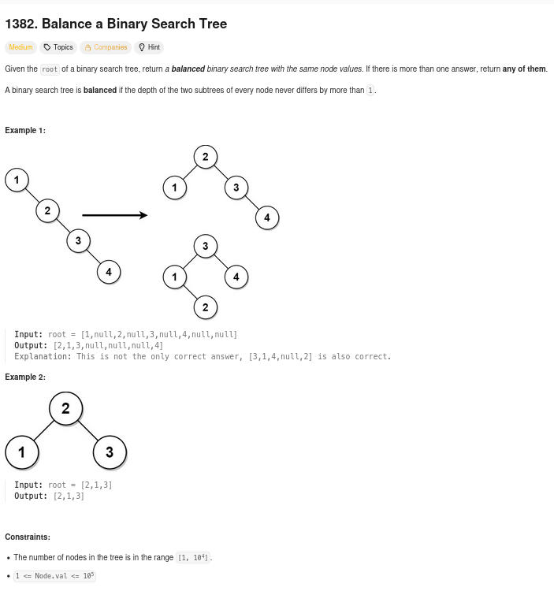
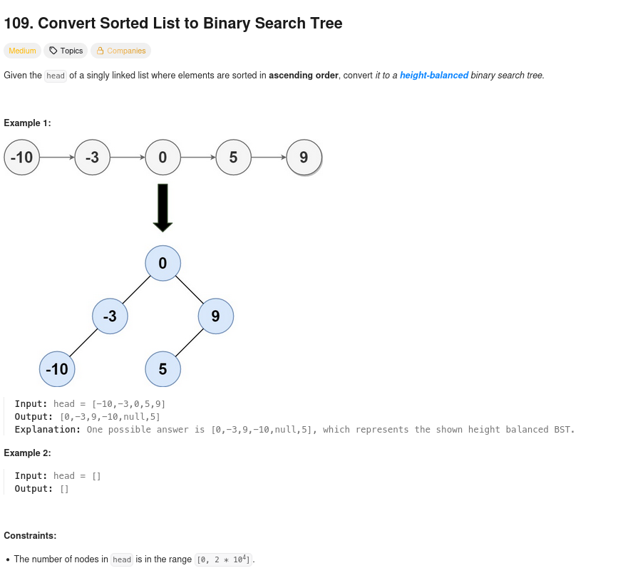
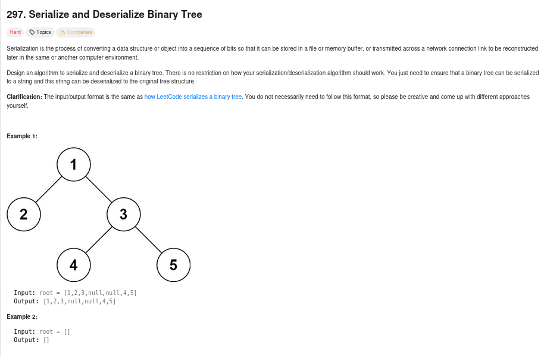

# Repositório Template

## Alunos  
| Matrícula | Nome |  
|-----------------------|---------------------|  
| 20/2023663 | Gabriel Basto Bertolazi |  
| 18/0100271 | Emivalto Costa Tavares Júnior |  
## Descrição do projeto

## Guia de instalação

sudo apt update && sudo apt install -y build-essential

### Dependências do projeto

Compilador C: GCC ≥ 10 ou Clang ≥ 12

### Como executar o projeto

gcc questao_x.c -o questao_x && ./questao_x

## Capturas de tela das questões feitas

### Questão 1

#### Captura de tela da questão

#### Captura de tela dos resultados

### Questão 2

#### Captura de tela da questão

#### Captura de tela dos resultados

### Questão 3

#### Captura de tela da questão

#### Captura de tela dos resultados

